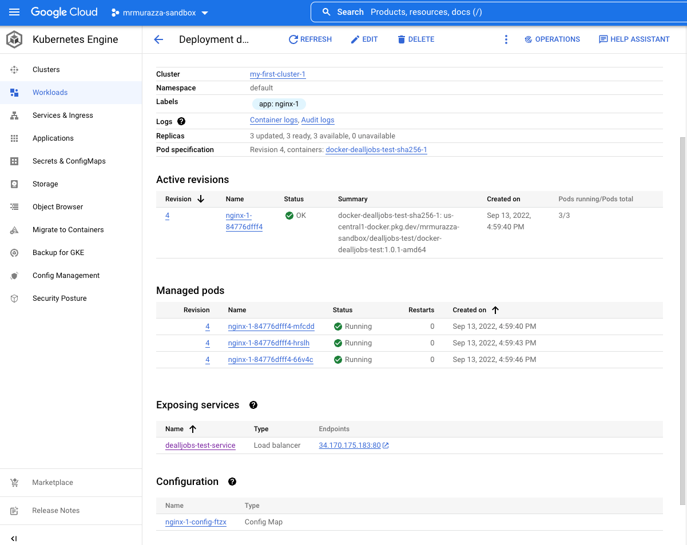

# Quickstart Guide to Set up Dev Workspace

1. Git clone git@github.com:mrmurazza/razza-simple-auth-app.git
2. Make sure you have Go installed and set up Go workspace
3. Install the dependencies by running `go mod download`
4. Go to your project folder using `cd` and run your project using:

   `$ go run main.go`

5. For deployment, run this command to build binary file

   `$ go build main.go`

# Project Structure

```
.
├── config                          > contains config file that reads from env variable
├── domain                          > contains the main business logic grouped by its domain
│     └── user                      
│        ├── impl                   > contains class implementation of service & repo
│        ├── entity.go              > file contains domain model and data object related to the domain 
│        └── type.go                > file contains interface declaration of service & repo
├── dto                             > contains data object used in endpoint requests & response
├── handler                         > contains handler class responsible to handle inputs from external to domain & parsing response from domain to external
├── pkg                             > contains package or util class used by the domain
├── README.md
├── main.go                         > Main Go file
└── Dockerfile 

```

# Project Component

Basically, this project is separated into several components:

1. Handler : responsible on preparing the inputs and serving the outputs and the one to call the business logic code.
2. Domain: contains main business logics consist of Type, Service, Repository, & Entity/Model

   2.1. Type : contains interface declaration of service & repository, one of dependency inversion implementation

   2.2. Service : contains service implementation responsible on handling the main core of the business logic. (
   ex: `domain/user/impl/service.impl.go`)

   2.3. Repository : responsible on handling DB queries. (ex: `domain/user/impl/repo.impl.go`)

   2.4. Entity : contains data object (struct/entity) highly related with core domain or event its domain model itself (
   ex: `domain/user/entity.go`)
3. DTO (Data Transfer Object): contains data object related to API requests & responses
4. PKG (Package): contains utils or specific package used by the core domain

# API Docs

In this GitHub repo provided the API docs using Postman Collection & Postman Environment Variable export files.
The endpoint besides Login will need to bear Authorization with Bearer Token that you get once you log in.

However, using this Postman collection below, your token will be stored in the environment variables once you success Log in, 
so you do not need to manually copy & paste the token to other requests each time after you log in.

[Postman Collection JSON Export File](postman/Deall%20Jobs%20Assessment.postman_collection.json)

[Postman Environment Variable JSON Export File](postman/environment/8d0bde94-c3cc-423a-968a-09d7171c4f84.json)

Below some screenshot of the Postman

### Login by Admin


### Create User by Admin


### Get All Users by Admin


### Get All Users by Users
In general this is the response you get when user access outside read their own data


# Notes Regarding the Assessment:
1. This simple Auth & User CRUD App is already deployed in Google Cloud Platform - GKE that can be accessed in this IP: `http://34.170.175.183`
2. The url already set in the Postman Environment Variable json ready to use. 
3. The Admin Credentials that can be used to log in are:
   ```
   username: admin
   password: 123456
   ```
4. Detail regarding the Kubernetes configuration are provided with .yaml file for service & deployments and screenshot of GKE console below:
   
   ### Kubernetes .yaml file

   [deployment.yaml](kube/deployment.yaml)

   [service.yaml](kube/service.yaml)
   
   ### Screenshot

   GKE Cluster:

   

   GKE Container:

   

   GKE Deployment Detail:

   

5. The architecture diagram of this app

   
